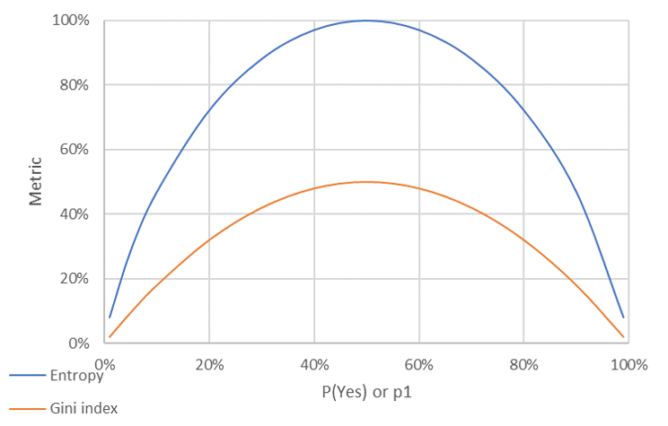

# Gini index, an Entropy alternative
The Gini Index is an alternative to entropy for information value calculations. The Gini index is very commonly the default information value metric in many machine learning algorithms, including in Python Sci-Kit Learn.

For binary classifications (yes/no, 1/0, true/false), the equations are:

(1) Entropy:     

(2) Gini index:  

For comparisons between the two measures:
```
    p1  (1 - p1)      Entropy    Gini index
------  -------  ------------  ------------
   50%      50%        100.0%         50.0%
   40%      60%         97.1%         48.0%
   30%      70%         88.1%         42.0%
   20%      80%         72.2%         32.0%
   10%      90%         46.9%         18.0%
    5%      95%         28.6%          9.5%
    1%      99%          8.1%          2.0%
```

Overall, for binary classifiers, the metrics are not that different, although steepness of the curve for additional segmentation differs slightly as you approach pure segments of 100% / 0%. See figure 1 for a comparison of the two metrics:

Figure 1: Entropy and Gini index vs. p1


For this class, there is no preference for Entropy over Gini index. We will use Entropy in Excel to follow along with the course material but sklearn uses gini index by default.
