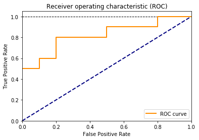

# Plotting in MatPlotLib
If you have a process to use PowerBI or Tableau in your production pipeline, matplotlib is not really necessary; however, matplotlib is great for fast, inline charts and graphs as you build out python code, especially in Jupyter Notebooks where data exploratation and analysis can be inline and saved.

The plotting is very flexible, but not as fast as something like Tableau or PowerBI. The advantage of Matplotlib is that you can do it inline with your development without having to export your data and import it into Tableau or PowerBI. This can make basic visualizations faster for developers.

There are many matplotlib guides out there on the internet, so this is a very brief introduction. For reference, this library was originally based off the MATLAB plotting functions from awhile back, implemented in Python (and other various languages). 
### Getting started with MatPlotLib
```
import matplotlib.pyplot as plt
```

#### Making a figure
We start a figure with `plt.figure()` and show it after we are done with `plt.show()`
```
plt.figure()

# Figure details go here...

plt.show()
```

We can keep drawing plots, which add to the same figure until we set a new plot.
This plots a couple curves

```
# Setup a true and false positive rate (hypothetical)
tpr = [0.5,0.5,0.6,0.6,0.8,0.8,0.9,0.9,1.0,1.0]
fpr = [0.0,0.1,0.1,0.2,0.2,0.5,0.5,0.8,0.8,1.0]

# Start a plot
plt.figure()

# Dotted line for 100%
plt.plot([0,1],[1,1], color='black', linestyle='--', lw=1)

# 0-> 1 line for 50/50 (no predictive power)
plt.plot([0,1],[0,1], color='navy', linestyle='--', lw=2)

# ROC plot
plt.plot(fpr, tpr, color='darkorange', label='ROC curve', lw=2)

# set up axes
plt.xlim([0.0,1.0])
plt.ylim([0.0,1.05])

# set up labels and legend
plt.xlabel('False Positive Rate')
plt.ylabel('True Positive Rate')
plt.title('Receiver operating characteristic (ROC)')
plt.legend(loc="lower right")

# Show the plot
plt.show()
```

Resulting Plot


